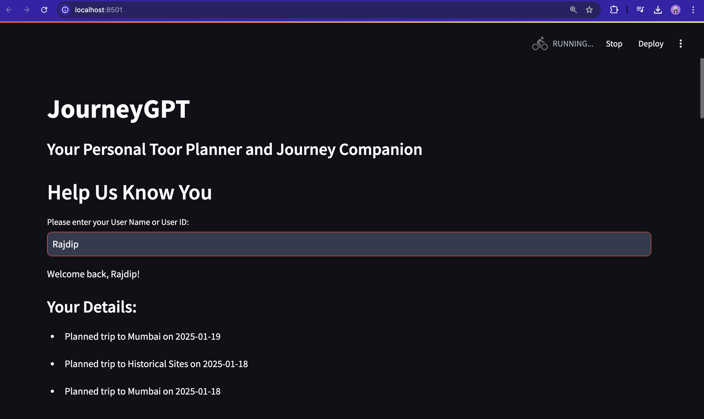
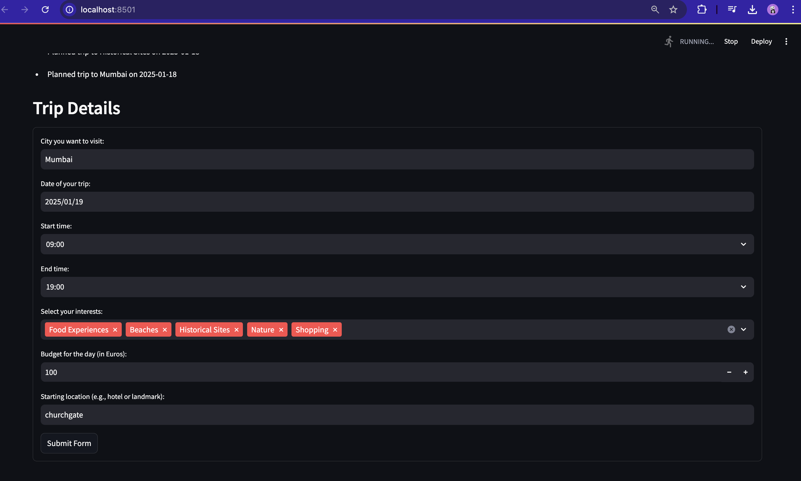
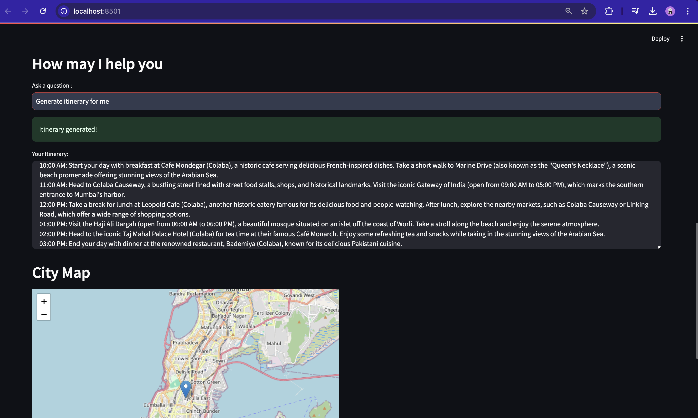
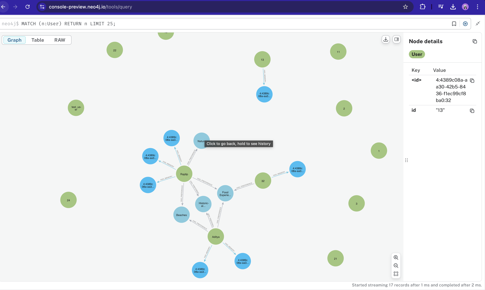

# JourneyGPT
 
JourneyGPT is an travel companion powered by LLM agent system. The core of the system utilizes Ollama and Llama3.2, a state-of-the-art local large language model (LLM) designed for on-device inference. This ensures high performance while maintaining data privacy, as all computations and decision-making processes occur locally on the user's device.

## Demo and Screenshots

 
 ###               Homepage and User Details :
   
---

 ###                Trip Planning Form:
   
   ---
###              Generated Itinerary and Interactive Map:
   
   ---

###                  Neo4j Database Instance
- **Connection Overview**:

---
 
By leveraging Ollama Llama, JourneyGPT provides personalized and context-aware responses, offering real-time itinerary planning, dynamic user memory management, and seamless interaction. This architecture allows the application to function efficiently even in low-connectivity environments, ensuring a consistent and agent-driven user experience.

JourneyGPT also ensures that **user data is securely stored in a Neo4j graph database**. User preferences and memories are retained, allowing the system to prefill trip details and suggestions when the user returns. This personalized approach creates a seamless and intuitive experience for repeat users, saving time and enhancing satisfaction.


A key feature of JourneyGPT is its integrated chatbot. This chatbot  handles user queries by either:
1. **Calling specific backend functions**: For tasks like itinerary generation, weather fetching, or event discovery, the chatbot routes the query to predefined APIs or models to deliver accurate, actionable results.
2. **Using its own knowledge base**: If a query falls outside the predefined functions, the chatbot directly responds based on its extensive training, ensuring a smooth and responsive user experience.

By combining the power of localized LLM inference with dynamic function execution, JourneyGPT ensures fluid interactions, making travel planning effortless and intuitive.

## Features
- **User Preferences and Memories**: Personalized travel suggestions using Neo4j for memory and preference storage.
- **Itinerary Generation**: Generate customized itineraries based on user interests, budget, and time constraints.
- **Weather Integration**: Real-time weather forecasts for better planning.
- **Local Events Discovery**: Find events in your chosen destination.
- **Interactive Map Visualization**: Visualize destinations on an interactive map.

---

## Getting Started

### Prerequisites
- Python 3.8 or above
- Neo4j database instance
- API keys for:
  - Weather API
  - News API
  - OpenCage Geocoder

### Installation
1. Clone the repository:
   ```bash
   git clone https://github.com/rajdip-i/journeygpt.git
   cd journeygpt
   ```
2. Install dependencies:
  
3. Set up your `.env` file with the required environment variables. Use the placeholders below:
   ```
   NEO4J_URI=your_neo4j_uri
   NEO4J_USERNAME=your_neo4j_username
   NEO4J_PASSWORD=your_neo4j_password
   WEATHER_API_KEY=your_weather_api_key
   NEWS_API_KEY=your_news_api_key
   OPENCAGE_API_KEY=your_opencage_api_key
   ```
4. Run the backend server:
   ```bash
   uvicorn app:app --reload
   ```
5. Run the Streamlit frontend:
   ```bash
   streamlit run frontend.py
   ```

---

## Architecture Overview
1. **Backend**:
   - Built with FastAPI for RESTful services.
   - Handles memory and preference management using Neo4j.
   - Integrates weather and event APIs for real-time data.

2. **Frontend**:
   - Developed using Streamlit.
   - Interactive UI for itinerary planning and trip details.

3. **Memory and Preferences**:
   - Uses Neo4j to store and retrieve user-specific data.

---


## Environment Variables
| Variable          | Description                           |
|-------------------|---------------------------------------|
| `NEO4J_URI`       | URI for the Neo4j instance            |
| `NEO4J_USERNAME`  | Username for Neo4j authentication     |
| `NEO4J_PASSWORD`  | Password for Neo4j authentication     |
| `WEATHER_API_KEY` | API key for WeatherAPI                |
| `NEWS_API_KEY`    | API key for NewsAPI                   |
| `OPENCAGE_API_KEY`| API key for OpenCage Geocoder         |

---

